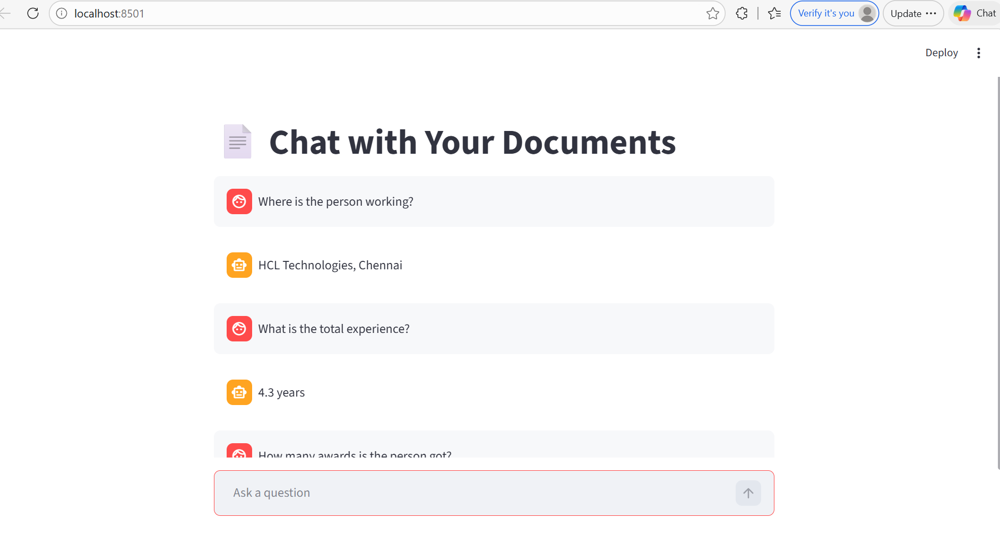

# MultiPDF Chatbot Using RAG

An AI-powered chatbot that allows users to ask questions from multiple PDF documents using Retrieval-Augmented Generation (RAG).

---

##  Highlights

- Semantic search using embeddings (not keyword-based)
- Supports multiple PDF documents
- Uses QA model to extract precise answers
- Chunk-level retrieval + best answer selection
- Displays source context for transparency
- Interactive UI built with Streamlit

---

## Demo

Example:


---

## How It Works

```text
PDF Documents
     ↓
Text Chunking
     ↓
Embeddings (Sentence Transformers)
     ↓
Vector Database (ChromaDB)
     ↓
Retriever (MMR Search)
     ↓
QA Model (Hugging Face)
     ↓
Final Answer + Source
```

## Features
- Ask questions from multiple documents
- Accurate answers using context retrieval
- Works across different domains (resume, reports, etc.)
- Displays relevant source content
- Handles large documents efficiently

## Tech Stack
- Python
- Streamlit
- LangChain
- ChromaDB
- Hugging Face Transformers
- Sentence Transformers

## Project Structure
multipdf_chatbot/
│
├── app.py
├── data/              # Add your PDF files here
├── requirements.txt
└── README.md

## Installation
```
git clone https://github.com/Jothi1199/multipdf_chatbot.git
cd multipdf_chatbot
pip install -r requirements.txt
```

## Run the App
```
streamlit run app.py
```

## Example Questions
- Where is the person working?
- What is the total experience?
- when she got ERS Process champion award?
- what is the role?

## Notes
- Place your PDF files inside the /data folder
- Works best with fact-based questions (not yes/no questions)

## Future Improvements
- FastAPI backend integration
- Docker deployment
- Chat history (memory)
- Better LLM-based responses (FLAN / GPT)

## Author
Anandha Jothi S